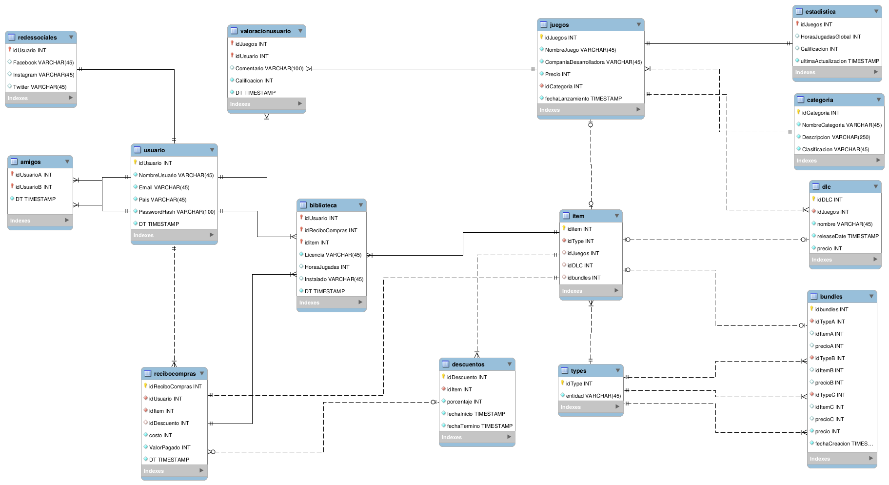

# [INF239] Tarea Semestral: Entrega \#2

__Integrantes:__

			- Mauricio Aravena			
			- Ricardo Mardones

## Modificaciones y correcciones al modelo:  __¡ dopamine_v3 !__

Nuestra compañia ha escuchado el feedback que hemos obtenido por parte de los usuarios, acerca de las mejoras que debemos implementar, por lo que se ha actualizado el modelo de nuestra base de datos para poder suplir las demandas de nuestros distinguidos clientes, es por esto que hemos llevado nuestro modelo a su versión \#3. Demos la bienvenida a __dopamine_v3__. A continuación se hace un desglose de los __nuevos y emocionantes cambios__.

### Changelog:

__1. No tienen una entidad para representar paquetes/bundles ni tampoco para otros tipos de contenidos digitales.__

Se ha creado la entidad solicitada, se especifica en el siguiente punto.

__2. Falta la representación de paquetes/bundles y de otros contenidos digitales, aparte de los juegos.__

Para cumplir con estos requisitos, se añaden cuatro tablas al modelo. La primera _dlc_, nos permite ofrecer a nuestros clientes el contenido extra de todos sus juegos favoritos.

La segunda tabla que hemos añadidos es __bundles__, la cual nos permite extender nuestras ofertas al poder ofrecer un máximo de tres tipos distintos de contenidos, los cuales pueden ser juegos o DLCs, a un precio rebajado por el conjunto. La cantidad de items en un bundles puede ser a lo menos dos items y como máximo tres. De esta forma, si un bundle tiene menos de límite de itmes, el idItemC estará con valor NULL en su respectiva columna. Además la tabla bundles, almacena el precio de cada uno de los contenidos al momento de su adición y el precio respectivo del bundle (el cual es un populado con un valor que corresponde a un factorentre 0.5 y 0.9 que multiplica los precios de los items individuales).  __OJO: Para poder acceder al precio rebajado no debes tener ninguno de los items dentro del bundle en tu biblioteca - ya adquirido - o no podrás realizar la compra.__ Esto se decidió ya que nuestro sistema por el momento no permite elementos duplicados en la biblioteca. (se profundizará en la información de la columna idtype cuando se presente la tabla __types__)

Un ejemplo de fila para la tabla bundles en la que solo hay dos items en el paquete:

| idbundles | idTypeA | idItemA | precioA | idTypeB |  idItemB | precioB| idTypeC |  idItemC | precioC | precio | fechaCreacion|
|-----------|---------|---------|---------|---------|----------|--------|---------|----------|---------|--------|--------------|
|   5       |   0     |     12  |  9500   |    1    | 51       | 12300  |  NULL   | NULL     | NULL    | 21800	| 2020-12-13 12:16:26|

Un ejemplo de fila para la tabla bundles en la que hay tres items en el paquete:

| idbundles | idTypeA | idItemA | precioA | idTypeB |  idItemB | precioB| idTypeC |  idItemC | precioC | precio | fechaCreacion|
|-----------|---------|---------|---------|---------|----------|--------|---------|----------|---------|--------|--------------|
|   2       |   0     |     14  |  5000   |    1    | 48       | 14000  |  0      | 17       | 9700    | 28700	| 2020-12-13 12:16:26|

Con respecto a la tabla biblioteca, dados estos nuevos cambios a nuestro modelo, nos hemos visto en la necesidad de generalizar las cosas, por lo que hemos introducido una nueva tabla __items__, en la cual tenemos un mapeo de todos los contenidos ofrecidos en nuestra plataforma. Cada contenido ahora es mapeado a una fila de esta tabla, donde se indica el tipo de contenido (más acerca de esto a continuación), y el id correspondiente al contenido asociado, a lo cual se asocia un id único que puede ser usado en cualquiera de nuestros servicio para poder identificar el contenido sobre el cual se hace una transacción. Por ejemplo en el caso de un juego: "Solitario" - idJuegos = 145, la entrada en la tabla items se vería de la forma:

| idItem | idType | idJuegos | idDLC | idBundles |
|--------|--------|----------|-------|-----------|
|   106  |   0    |     145  |  NULL |    NULL   |

Analizando este caso, tenemos el identificador único en la primera columna, luego tenemos un código asociado al tipo de contenido que se está registrando (en la columna idType un 0 para juegos, 1 en caso de DLC o 2 si es un bundle. Se ahonda en esto más adelante cuando se describa la tabla __types__), luego en las últimas columnas el id asociado a la entrada. Note que en este caso, como se está registrando un juego, idType indica que se debe rellenar la columna de idJuegos con el id proveniente de la tabla del contenido y se deben dejar los otros en valor NULL. Por ejemplo al registrar la expansión "TETRIS: 1001 Nuevos niveles " - idDLC = 99, se registraría:

| idItem | idType | idJuegos | idDLC | idBundles |
|--------|--------|----------|-------|-----------|
|   173  |   1    |     NULL |  99 |    NULL   |

Habiendo terminado con el funcionamiento de la tabla item, podemos explicar, como implementamos el código de idType, esta es una referencia a la cuarta tabla agregada al modelo __types__, en la cual almacenamos todos los tipos de contenidos que ofrecemos, en estos momentos la tabla luce de la siguiente manera:

| idTypes | entidad |
|---------|---------|
| 0 | juegos |
| 1 | dlc |
|2 | bundles |

La idea de esta tabla, es poder saber a partir del id único - idTypes - la naturaleza del contenido referenciado por la tabla items o bundles (note que aplicamos la misma idea). De esta manera, en el futuro podemos extender de manera fácil los contenidos ofrecidos añadiendo una entrada a la tabla __types__ y una columna a la tabla items, en el caso de que los contenidos ofrecidos sean demasiados y no sea aplicable añadir columnas a la tabla items, se puede mantener una columna con idGenerico donde se inserte el id del contenido.

Dada esta nueva generalización algunas tablas fueron afectadas y tuvieron que ser adaptadas para funcionar bajo esta nueva versión, las indicamos a continuación:

- descuentos
- reciboscompras

__3. Cuidado! En muchas partes pones relaciones 1:1 cuando en realidad debiese ser 1:N. Esto afecta a la interpretación del modelo.__

Tomamos nota de esto y para esta versión hemos revisado todas las relaciones de nuestras tablas, para poder garantizar que las relaciones ahora están acordes a lo que originalmente buscaban transmitir. Cambios sobre esto se enumaran a continuación:

1. valoracionusuario: La correción permite que un juego aparezca mas de una vez referenciado en la tabla. Anteriormente, el primer usuario que valoraba un juego especifico, bloqueaba a ese juego de ser valorado por otros usuarios.

2. descuentos: Además de reformarse la relación entre reciboscompras - biblioteca y descuento, se tomo en consideración que la anterior relación entre descuentos y biblioteca, permitia que un descuento apareciaria una única vez en la tabla, bloqueando su uso por parte de otras entradas, por lo que ahora que fue reformada la relación, se consideró y corrigió la relación.

3. categoria: Ahora más de un juego puede pertenecer a una categoria

__4. Las claves foráneas que a la vez son primarias no tienen sentido en algunas tablas si es que ya tengo una id como primaria.__

Analizamos el modelo y encontramos efectivamente errores de esta índole, los cuales corregimos, estos cambios afectaron a las siguientes tablas:

1. Juegos: La clave foránea categoría ya no es más una primary key.
2. biblioteca: Se removio la clave primaria única y se estandarizó el uso de tres claves foráneas que conformar la PK: idUsuario, idReciboCompras, idItem.
3. valoracionusuario: Se removió la clave primaria única y se adoptó el uso de dos claves foráneas para conformar la PK : idJuegos, idUsuario.
4. estadistica: Se utiliza como PK el id del juego asociado.

__5. En la mayoría de las FK no son llamadas como la referencia.__

Se hizo una revisión completa y se estandarizó el uso del nombre de origen de la clave foránea, a excepción de las tablas donda la clave foránea pudiese aparecer más una vez, como en el caso de la tabla __amigos__ donde idUsuarioA e idUsuarioB son referencias a idUsuario en la tabla usuario.

__6. La FK que está en la relación entre redes sociales y usuario está al revés. Me están diciendo que una red social puede tener un único usuario.__

Creemos que esto es un malentendido, la tabla redessociales, en cada una de sus entradas, registra las redes sociales que uno de nuestros usuarios pudiese tener, a esto le asociamos como clave primaria de tabla, la clave fóranea correspondiente al idUsuario, lo que indicadiria que en esta tabla tenemos asociado al único id de cada usuario un registro con la URL a las redes sociales del usuario.

__7. Las semánticas de tiempo presentes están muy forzadas y la semántica de tiempo más importante (para la compra) no está presente.__

Estamos totalmente de acuerdo, sin mentir, era tarde y nos dimos cuenta que habíamos olvidado las referencias temporales. Ahora hemos corregido este error. Las tablas afectadas:
1. reciboscompras: Se añade timestamp de la transacción
2. biblioteca: Timestamp de cuando se añadió el juego a la tabla.
3. descuentos: fechaInicio descuento y fechaTermino descuento, fueron añadidas.
4. dlc: releaseDate se añade.
5. bundles: fechaCreacion de el mismo.
6. juegos: fechaLanzamiento.

__8. A pesar que dicen en los supuestos que existen los casos Null, estos no están representados en el diagrama.__

Los casos Null fueron correctamente añadidos a las relaciones y tablas.

## Varios

Se entregan los siguientes archivos en el repositorio:
1. Jupyter notebooks con las consultes - Entrega_2.ipynb -
2. dopamine_v3.mwb: Modelo actualizado
3. funcionesPopulacion.py : Funciones para la populación coherente y automática de datos cpara las tablas del modelo
4. Archivos relacionados a la populacion:
	- juegos_clean.txt: Listado con 100 juegos + datos relacionados a estos
	- paises.txt: Listado de 193 paises.
	- usernames.txt: Listado de 100 usernames.
